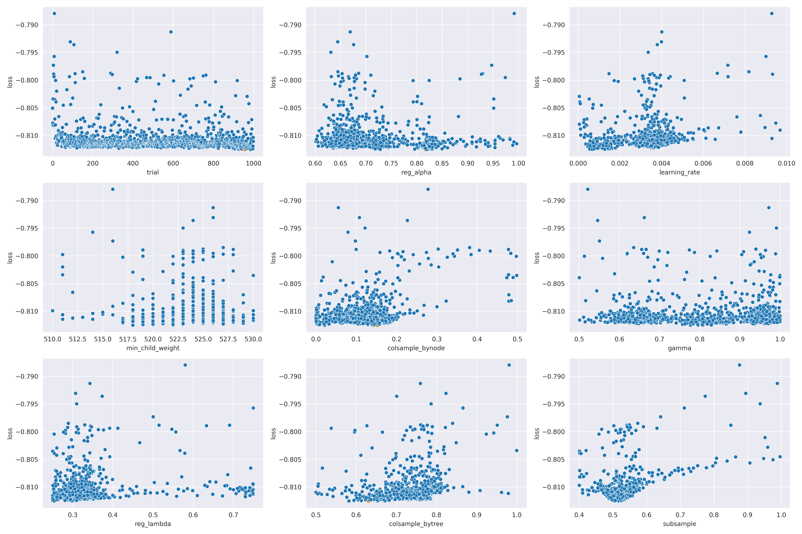

===========
Performance
===========

--------
Overview
--------

* The XGBoost model is underperforming relative to expectation. Hyperparameter tuning is
  one potential source of improvement; another source is additional data.
* The Lifelines model closely mirrors the performance of the NBA model, with a noticeable
  advantage in pre-game prediction.

-----------
Performance
-----------

.. important::

    At this time the models have been trained on the 2016-17 and 2017-18 seasons.

Figure 1 shows the AUROC over game-time for each model.

.. image:: ../_static/auroc.png
    :align: center
    :alt: Figure 1

Figure 2 directly shows the AUROC lift of each survival model against the NBA win probability
model.

.. image:: ../_static/auroc_lift.png
    :align: center
    :alt: Figure 2

---------------------
Hyperparameter tuning
---------------------

Figure 3 shows the hyperparameter tuning results for the ``lifelines`` model. The tuning was done
using 100 evaluations.

.. image:: ../_static/lifelines-tuning.png
    :align: center
    :alt: Figure 3

Figure 4 shows the hyperparameter tuning results for the ``xgboost`` model. The tuning was done
using 300 evaluations.

