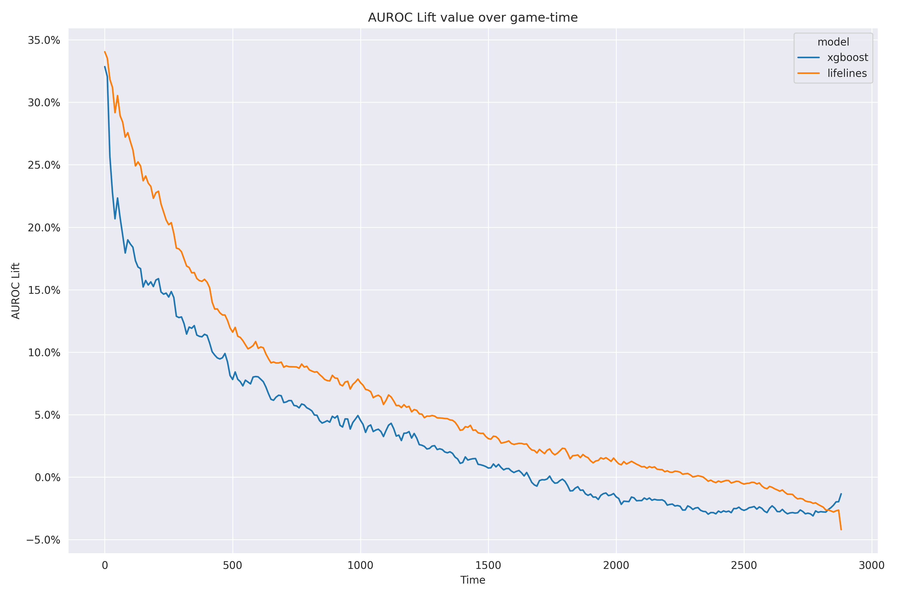

===========
Performance
===========

--------
Overview
--------

* The XGBoost and Lifelines models are performing similarly.
* Both models perform similarly to the NBA's win probability, with a noticeable uptick in
  pre-game performance.

-----------
Performance
-----------

.. important::

    At this time the models have been trained on the 2015-16, 2016-17, 2017-18, and 2018-19 seasons.

Figure 1 shows the AUROC over game-time for each model.

Figure 2 directly shows the AUROC lift of each survival model against the NBA win probability
model.

Overall, the average AUROC lift for each model is summarized below:

+-----------+---------+
| Model     | Lift    |
|           |         |
+===========+=========+
| XGBoost   | 0.00149 |
+-----------+---------+
| Lifelines | 0.00437 |
+-----------+---------+

---------------------
Hyperparameter tuning
---------------------

Figure 3 shows the hyperparameter tuning results for the ``lifelines`` model. The tuning was done
using 1 000 evaluations.

.. image:: ../_static/lifelines-tuning.png
    :align: center
    :alt: Figure 3

Figure 4 shows the hyperparameter tuning results for the ``xgboost`` model. The tuning was done
using 10 000 evaluations.

.. image:: ../_static/xgboost-tuning.png
    :align: center
    :alt: Figure 4
