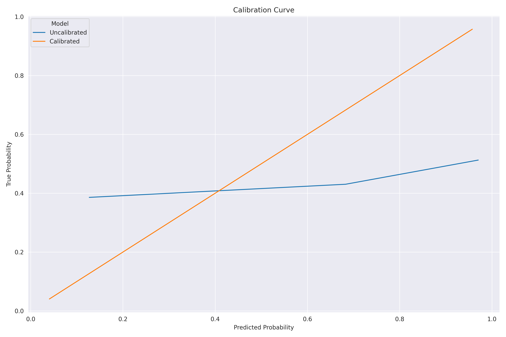

===========
Performance
===========

--------
Overview
--------

* Both models perform better (on average) than the NBA's model, with a particular advantage in
  early game prediction.
* The Lifelines model far outperforms the XGBoost model.

For generating player ratings, we will use the Lifelines model.

-----------
Performance
-----------

.. important::

    At this time the models have been trained on data from the 2005-06 through the 2019-20 seasons
    (pre-bubble). The final build dataset had XX XXX games with X XXX XXX rows; the tuning/stopping
    datasets had X XXX games with XXX XXX rows.

Figure 1 shows the AUROC over game-time for each model.

.. image:: ../_static/auroc.png
    :align: center
    :alt: Figure 1

Figure 2 directly shows the AUROC lift of each survival model against the NBA win probability
model.

.. image:: ../_static/auroc_lift.png
    :align: center
    :alt: Figure 2

Overall, the average AUROC lift for each model is summarized below:

+-----------+---------------+--------------------------------+
| Model     | Average AUROC | Percentage lift over NBA model |
|           |               |                                |
+===========+===============+================================+
| XGBoost   | 0.822         | 2.863%                         |
+-----------+---------------+--------------------------------+
| Lifelines | 0.845         | 6.102%                         |
+-----------+---------------+--------------------------------+

---------------------
Model Characteristics
---------------------

~~~~~~~~~
Lifelines
~~~~~~~~~

Figure 3 shows the hyperparameter tuning results for the ``lifelines`` model. The tuning was done
using 1 000 evaluations.

.. image:: ../_static/lifelines-tuning.png
    :align: center
    :alt: Figure 3

Tuning led to the following final hyperparameters:

+----------------+----------------------+
| Hyperparameter | Value                |
|                |                      |
+================+======================+
| ``l1_ratio``   | 0.007837377210952526 |
+----------------+----------------------+
| ``penalizer``  | 0.09388117587887976  |
+----------------+----------------------+

with the following variable coefficients:

+----------------------------------+---------------+
| Variable                         | Coefficient   |
|                                  |               |
+==================================+===============+
| ``SCOREMARGIN``                  | 6.059660e-03  |
+----------------------------------+---------------+
| ``HOME_LINEUP_PLUS_MINUS``       | -6.037603e-08 |
+----------------------------------+---------------+
| ``VISITOR_LINEUP_PLUS_MINUS``    | -3.438323e-07 |
+----------------------------------+---------------+
| ``HOME_NET_RATING``              | 3.071953e-03  |
+----------------------------------+---------------+
| ``VISITOR_NET_RATING``           | -2.805900e-03 |
+----------------------------------+---------------+
| ``HOME_W_PCT``                   | 4.033127e-02  |
+----------------------------------+---------------+
| ``VISITOR_W_PCT``                | -4.164156e-02 |
+----------------------------------+---------------+
| ``LAST_GAME_WIN``                | 9.586388e-03  |
+----------------------------------+---------------+
| ``HOME_GAMES_IN_LAST_3_DAYS``    | -1.518382e-05 |
+----------------------------------+---------------+
| ``VISITOR_GAMES_IN_LAST_3_DAYS`` | 5.745046e-06  |
+----------------------------------+---------------+
| ``HOME_GAMES_IN_LAST_5_DAYS``    | -9.242708e-06 |
+----------------------------------+---------------+
| ``VISITOR_GAMES_IN_LAST_5_DAYS`` | 2.554729e-06  |
+----------------------------------+---------------+
| ``HOME_GAMES_IN_LAST_7_DAYS``    | -1.492246e-05 |
+----------------------------------+---------------+
| ``VISITOR_GAMES_IN_LAST_7_DAYS`` | 1.824475e-06  |
+----------------------------------+---------------+

Isotonic regression produced the following calibration plot:

~~~~~~~
XGBoost
~~~~~~~

Figure 5 shows the hyperparameter tuning results for the ``xgboost`` model. The tuning was done
using 1 000 evaluations.

.. image:: ../_static/xgboost-tuning.png
    :align: center
    :alt: Figure 5

Tuning led to the following hyperparameters:

+--------------------------+--------------------------------------------+
| Hyperparameter           | Value                                      |
|                          |                                            |
+==========================+============================================+
| ``colsample_bylevel``    | 0.8313910793985154                         |
+--------------------------+--------------------------------------------+
| ``colsample_bynode``     | 0.091553664397192                          |
+--------------------------+--------------------------------------------+
| ``colsample_bytree``     | 0.965672861241127                          |
+--------------------------+--------------------------------------------+
| ``gamma``                | 0.751343370739138                          |
+--------------------------+--------------------------------------------+
| ``learning_rate``        | 0.006071133731874241                       |
+--------------------------+--------------------------------------------+
| ``max_delta_step``       | 1                                          |
+--------------------------+--------------------------------------------+
| ``max_depth``            | 4                                          |
+--------------------------+--------------------------------------------+
| ``min_child_weight``     | 516                                        |
+--------------------------+--------------------------------------------+
| ``monotone_constraints`` | (0, 0, 0, 0, 0, 0, 0, 0, 0, 0, 0, 1, 0, 0) |
+--------------------------+--------------------------------------------+
| ``reg_alpha``            | 0.6748161854062196                         |
+--------------------------+--------------------------------------------+
| ``reg_lambda``           | 0.5767841610693845                         |
+--------------------------+--------------------------------------------+
| ``subsample``            | 0.5118933763828355                         |
+--------------------------+--------------------------------------------+

Isotonic regression produced the following calibration plot:

Since XGBoost doesn't produce directly interpretable coefficients like a linear model, we will
use `SHAP <https://github.com/slundberg/shap>`_ to produce feature importances:

.. image:: ../_static/xgboost-shap.png
    :align: center
    :alt: Figure 7
