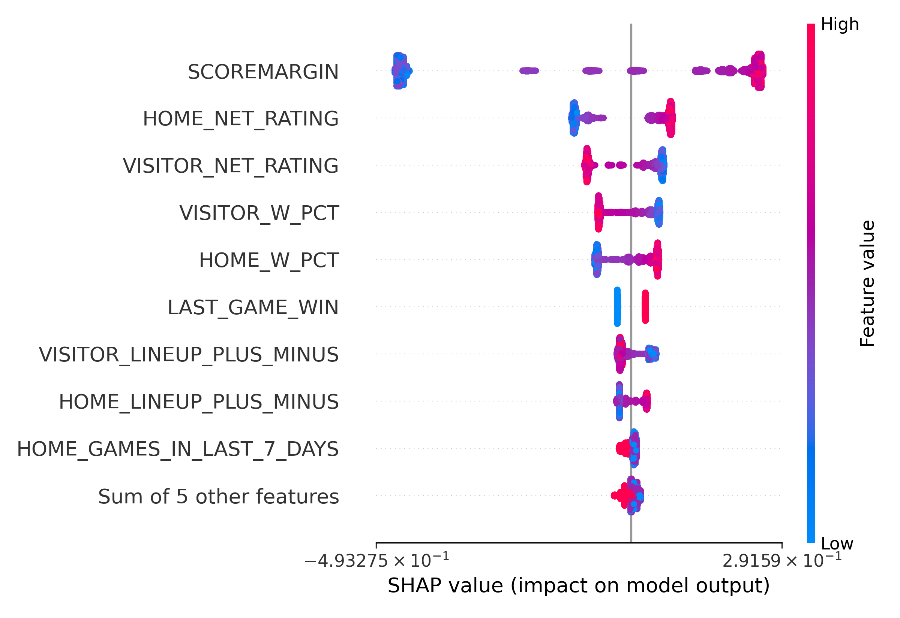

===========
Performance
===========

--------
Overview
--------

* Both models perform better (on average) than the NBA's model, with a particular advantage in
  early game prediction.
* The Lifelines model outperforms the XGBoost model.

For generating player ratings, we will use the Lifelines model.

-----------
Performance
-----------

.. important::

    At this time the models have been trained on data from the 2005-06 through the 2019-20 seasons
    (pre-bubble). The final build dataset had 10 765 games with 1 188 655 rows; the tuning/stopping
    datasets had 3 589 games with 396 863 rows; the holdout dataset had 3 589 games with 396 189 rows.

Figure 1 shows the AUROC over game-time for each model.

.. image:: ../_static/auroc.png
    :align: center
    :alt: Figure 1

Figure 2 directly shows the AUROC lift of each survival model against the NBA win probability
model.

.. image:: ../_static/auroc_lift.png
    :align: center
    :alt: Figure 2

Overall, the average AUROC lift for each model is summarized below:

+-----------+---------------+--------------------------------+
| Model     | Average AUROC | Percentage lift over NBA model |
|           |               |                                |
+===========+===============+================================+
| XGBoost   | 0.808         | 3.3%                           |
+-----------+---------------+--------------------------------+
| Lifelines | 0.831         | 6.315%                         |
+-----------+---------------+--------------------------------+

---------------------
Model Characteristics
---------------------

~~~~~~~~~
Lifelines
~~~~~~~~~

Figure 3 shows the hyperparameter tuning results for the ``lifelines`` model. The tuning was done
using 1 000 evaluations.

Tuning led to the following final hyperparameters:

+----------------+----------------------+
| Hyperparameter | Value                |
|                |                      |
+================+======================+
| ``l1_ratio``   | 0.007994777879269076 |
+----------------+----------------------+
| ``penalizer``  | 0.09127606625097757  |
+----------------+----------------------+

Isotonic regression produced the following calibration plot:

.. image:: ../_static/lifelines-calibration.png
    :align: center
    :alt: Figure 4

~~~~~~~
XGBoost
~~~~~~~

Figure 5 shows the hyperparameter tuning results for the ``xgboost`` model. The tuning was done
using 1 000 evaluations.

.. image:: ../_static/xgboost-tuning.png
    :align: center
    :alt: Figure 5

Tuning led to the following hyperparameters:

+--------------------------+--------------------------------------------+
| Hyperparameter           | Value                                      |
|                          |                                            |
+==========================+============================================+
| ``colsample_bylevel``    | 1                                          |
+--------------------------+--------------------------------------------+
| ``colsample_bynode``     | 0.15221691031911938                        |
+--------------------------+--------------------------------------------+
| ``colsample_bytree``     | 0.6308916896893483                         |
+--------------------------+--------------------------------------------+
| ``gamma``                | 0.8083332824721229                         |
+--------------------------+--------------------------------------------+
| ``learning_rate``        | 0.0006959999989275942                      |
+--------------------------+--------------------------------------------+
| ``max_delta_step``       | 1                                          |
+--------------------------+--------------------------------------------+
| ``max_depth``            | 4                                          |
+--------------------------+--------------------------------------------+
| ``min_child_weight``     | 518                                        |
+--------------------------+--------------------------------------------+
| ``monotone_constraints`` | (0, 0, 0, 0, 0, 0, 0, 0, 0, 0, 0, 1, 0, 0) |
+--------------------------+--------------------------------------------+
| ``reg_alpha``            | 0.8166483270728037                         |
+--------------------------+--------------------------------------------+
| ``reg_lambda``           | 0.2533343088849453                         |
+--------------------------+--------------------------------------------+
| ``subsample``            | 0.5043820990853263                         |
+--------------------------+--------------------------------------------+

Isotonic regression produced the following calibration plot:

.. image:: ../_static/xgboost-calibration.png
    :align: center
    :alt: Figure 6

Since XGBoost doesn't produce directly interpretable coefficients like a linear model, we will
use `SHAP <https://github.com/slundberg/shap>`_ to produce feature importances:

